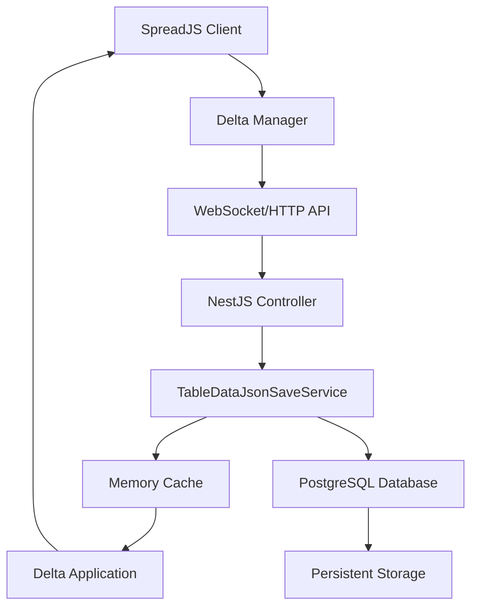

# SpreadJS 프론트엔드 연동 가이드

Extion Server의 델타 기반 자동저장 시스템과 SpreadJS 클라이언트를 연동하는 방법에 대한 상세 가이드입니다.

## 목차

1. [시스템 아키텍처 개요](#시스템-아키텍처-개요)
2. [데이터 구조 이해](#데이터-구조-이해)
3. [API 엔드포인트](#api-엔드포인트)
4. [실시간 델타 연동](#실시간-델타-연동)
5. [SpreadJS 이벤트 처리](#spreadjs-이벤트-처리)
6. [에러 처리 및 복구](#에러-처리-및-복구)
7. [성능 최적화](#성능-최적화)

## 시스템 아키텍처 개요



### 핵심 구성요소

- **SpreadJS Client**: 사용자 인터페이스 및 스프레드시트 렌더링
- **Delta Manager**: 변경사항 추적 및 서버 동기화
- **NestJS Backend**: 델타 처리 및 데이터 저장
- **PostgreSQL**: 영구 데이터 저장소

## 데이터 구조 이해

### 1. SpreadJS 기본 데이터 구조

SpreadJS는 다음과 같은 JSON 구조를 사용합니다:

```typescript
interface SpreadJSFormat {
  version?: string;
  name?: string;
  sheetCount?: number;
  sheets: {
    [sheetName: string]: {
      name: string;
      rowCount?: number;
      columnCount?: number;
      data: {
        dataTable: {
          [rowIndex: string]: {
            [colIndex: string]: {
              value?: any;
              formula?: string;
              style?: SpreadJSCellStyle;
            }
          }
        }
      }
    }
  }
}
```

### 2. 서버 내부 데이터 구조

서버는 SpreadJS 형식을 다음과 같이 변환합니다:

```typescript
interface SpreadSheetStructure {
  version: string;
  sheets: {
    [sheetName: string]: {
      name: string;
      data: {
        dataTable: {
          [cellAddress: string]: {  // "A1", "B2" 등
            value?: string | number | boolean | null;
            formula?: string;
            style?: CellStyle;
          }
        }
      }
    }
  }
}
```

### 3. 델타 데이터 구조

변경사항은 다음 델타 형식으로 추적됩니다:

```typescript
interface CellDelta {
  action: DeltaAction;           // 액션 타입
  sheetName: string;            // 대상 시트명
  cellAddress?: string;         // 셀 주소 (A1, B2 등)
  range?: string;              // 범위 (A1:B5 등)
  value?: any;                 // 새로운 값
  formula?: string;            // 수식
  style?: CellStyle;           // 스타일
  rowIndex?: number;           // 행 인덱스
  columnIndex?: number;        // 열 인덱스
  count?: number;              // 삽입/삭제 개수
  timestamp: number;           // 타임스탬프
}

enum DeltaAction {
  SET_CELL_VALUE    = "SET_CELL_VALUE",
  SET_CELL_FORMULA  = "SET_CELL_FORMULA",
  SET_CELL_STYLE    = "SET_CELL_STYLE",
  DELETE_CELLS      = "DELETE_CELLS",
  INSERT_ROWS       = "INSERT_ROWS",
  DELETE_ROWS       = "DELETE_ROWS",
  INSERT_COLUMNS    = "INSERT_COLUMNS",
  DELETE_COLUMNS    = "DELETE_COLUMNS",
  ADD_SHEET         = "ADD_SHEET",
  DELETE_SHEET      = "DELETE_SHEET",
  RENAME_SHEET      = "RENAME_SHEET"
}
```

## API 엔드포인트

### 베이스 URL
```
POST|GET|PUT|DELETE /v2/table-data-json-save/*
```

### 1. 스프레드시트 생성

```typescript
POST /v2/table-data-json-save/create

// 요청 본문
{
  fileName: string;              // 파일명
  spreadsheetId: string;         // UUID v4
  chatId: string;               // UUID v4
  userId: string;               // 사용자 ID
  initialData?: SpreadJSFormat; // 초기 데이터 (선택사항)
}

// 응답
{
  success: boolean;
  data: {
    id: string;
    fileName: string;
    data: SpreadSheetStructure;
    version: number;
    lastModified: Date;
  };
  message: string;
}
```

### 2. 스프레드시트 로드

```typescript
GET /v2/table-data-json-save/load/{spreadSheetId}?userId={userId}

// 응답
{
  success: boolean;
  data: {
    id: string;
    fileName: string;
    data: SpreadSheetStructure;
    version: number;
    lastModified: Date;
  };
  message: string;
}
```

### 3. 실시간 델타 적용

```typescript
PUT /v2/table-data-json-save/delta

// 요청 본문
{
  action: DeltaAction;
  sheetName: string;
  cellAddress?: string;       // "A1" 형식
  range?: string;            // "A1:B5" 형식
  value?: any;
  formula?: string;          // "=SUM(A1:A5)" 형식
  style?: {
    backgroundColor?: string; // "#FF0000" 형식
    color?: string;
    fontSize?: number;        // 6-72
    fontFamily?: string;
    fontWeight?: string;
    textAlign?: 'left' | 'center' | 'right' | 'justify';
    verticalAlign?: 'top' | 'middle' | 'bottom';
    border?: {
      top?: { style: string; color: string; width: number };
      right?: { style: string; color: string; width: number };
      bottom?: { style: string; color: string; width: number };
      left?: { style: string; color: string; width: number };
    };
  };
  rowIndex?: number;         // 0-1048575
  columnIndex?: number;      // 0-16383
  count?: number;           // 1-1000
  userId: string;
}

// 응답
{
  success: boolean;
  data: {
    version: number;
    applied: boolean;
  };
  message: string;
}
```

### 4. 일괄 델타 적용

```typescript
PUT /v2/table-data-json-save/deltas/batch

// 요청 본문
{
  deltas: ApplyDeltaDto[];  // 최대 100개
  userId: string;
}

// 응답
{
  success: boolean;
  data: {
    appliedCount: number;
    version: number;
  };
  message: string;
}
```

## 실시간 델타 연동

### 1. SpreadJS 클라이언트 설정

```typescript
class SpreadSheetDeltaManager {
  private spreadjs: GC.Spread.Sheets.Workbook;
  private userId: string;
  private isApplyingServerDelta = false;
  private pendingDeltas: CellDelta[] = [];
  private batchTimeout: NodeJS.Timeout | null = null;

  constructor(spreadjs: GC.Spread.Sheets.Workbook, userId: string) {
    this.spreadjs = spreadjs;
    this.userId = userId;
    this.setupEventListeners();
  }

  private setupEventListeners() {
    // 셀 값 변경 감지
    this.spreadjs.bind(GC.Spread.Sheets.Events.CellChanged, 
      (event, info) => this.handleCellChanged(info));
    
    // 스타일 변경 감지
    this.spreadjs.bind(GC.Spread.Sheets.Events.CellClick, 
      (event, info) => this.handleStyleChanged(info));
    
    // 행/열 삽입/삭제 감지
    this.spreadjs.bind(GC.Spread.Sheets.Events.RowChanged, 
      (event, info) => this.handleRowChanged(info));
    
    this.spreadjs.bind(GC.Spread.Sheets.Events.ColumnChanged, 
      (event, info) => this.handleColumnChanged(info));
  }
}
```

### 2. 변경사항 감지 및 델타 생성

```typescript
private handleCellChanged(info: any) {
  if (this.isApplyingServerDelta) return; // 서버 델타 적용 중 무시

  const sheet = this.spreadjs.getActiveSheet();
  const sheetName = sheet.name();
  const { row, col, oldValue, newValue } = info;
  
  // 셀 주소 변환 (row=0, col=0 → "A1")
  const cellAddress = this.convertToAddress(row, col);
  
  // 수식 확인
  const formula = sheet.getFormula(row, col);
  
  const delta: CellDelta = {
    action: formula ? 'SET_CELL_FORMULA' : 'SET_CELL_VALUE',
    sheetName,
    cellAddress,
    value: formula ? undefined : newValue,
    formula: formula || undefined,
    timestamp: Date.now()
  };

  this.queueDelta(delta);
}

private convertToAddress(row: number, col: number): string {
  const columnName = this.numberToColumn(col);
  return `${columnName}${row + 1}`;
}

private numberToColumn(num: number): string {
  let result = '';
  while (num >= 0) {
    result = String.fromCharCode(65 + (num % 26)) + result;
    num = Math.floor(num / 26) - 1;
  }
  return result;
}
```

### 3. 델타 배치 처리

```typescript
private queueDelta(delta: CellDelta) {
  this.pendingDeltas.push(delta);
  
  // 배치 처리를 위한 타이머 설정 (500ms 지연)
  if (this.batchTimeout) {
    clearTimeout(this.batchTimeout);
  }
  
  this.batchTimeout = setTimeout(() => {
    this.sendBatchDeltas();
  }, 500);
}

private async sendBatchDeltas() {
  if (this.pendingDeltas.length === 0) return;

  const deltas = [...this.pendingDeltas];
  this.pendingDeltas = [];

  try {
    const response = await fetch('/v2/table-data-json-save/deltas/batch', {
      method: 'PUT',
      headers: {
        'Content-Type': 'application/json'
      },
      body: JSON.stringify({
        deltas: deltas.map(delta => ({
          ...delta,
          userId: this.userId
        })),
        userId: this.userId
      })
    });

    const result = await response.json();
    
    if (!result.success) {
      console.error('Delta application failed:', result);
      // 실패한 델타들을 다시 큐에 추가하거나 재시도 로직
    }
  } catch (error) {
    console.error('Network error:', error);
    // 네트워크 오류 시 델타를 다시 큐에 추가
    this.pendingDeltas.unshift(...deltas);
  }
}
```

### 4. 서버에서 델타 수신 및 적용

WebSocket 또는 Server-Sent Events를 통해 다른 사용자의 변경사항을 실시간으로 받을 수 있습니다:

```typescript
private applyServerDelta(delta: CellDelta) {
  this.isApplyingServerDelta = true;
  
  try {
    const sheet = this.spreadjs.getSheetFromName(delta.sheetName);
    if (!sheet) return;

    const { row, col } = this.parseAddress(delta.cellAddress);

    switch (delta.action) {
      case 'SET_CELL_VALUE':
        sheet.setValue(row, col, delta.value);
        break;
        
      case 'SET_CELL_FORMULA':
        sheet.setFormula(row, col, delta.formula);
        break;
        
      case 'SET_CELL_STYLE':
        sheet.setStyle(row, col, delta.style);
        break;
        
      case 'INSERT_ROWS':
        sheet.addRows(delta.rowIndex, delta.count);
        break;
        
      case 'DELETE_ROWS':
        sheet.deleteRows(delta.rowIndex, delta.count);
        break;
        
      // ... 기타 액션들
    }
  } finally {
    this.isApplyingServerDelta = false;
  }
}

private parseAddress(address: string): { row: number, col: number } {
  const match = address.match(/^([A-Z]+)(\d+)$/);
  if (!match) throw new Error(`Invalid address: ${address}`);
  
  const col = this.columnToNumber(match[1]);
  const row = parseInt(match[2]) - 1;
  
  return { row, col };
}

private columnToNumber(column: string): number {
  let result = 0;
  for (let i = 0; i < column.length; i++) {
    result = result * 26 + (column.charCodeAt(i) - 64);
  }
  return result - 1;
}
```

## SpreadJS 이벤트 처리

### 주요 이벤트와 델타 매핑

| SpreadJS 이벤트 | Delta Action | 필수 파라미터 |
|----------------|--------------|---------------|
| CellChanged | SET_CELL_VALUE/SET_CELL_FORMULA | sheetName, cellAddress, value/formula |
| CellClick (스타일) | SET_CELL_STYLE | sheetName, cellAddress, style |
| RowChanged | INSERT_ROWS/DELETE_ROWS | sheetName, rowIndex, count |
| ColumnChanged | INSERT_COLUMNS/DELETE_COLUMNS | sheetName, columnIndex, count |
| SheetTabClick | ADD_SHEET/DELETE_SHEET | sheetName |

### 스타일 변경 처리

```typescript
private handleStyleChanged(info: any) {
  const sheet = this.spreadjs.getActiveSheet();
  const selection = sheet.getSelections()[0];
  
  if (!selection) return;
  
  const { row, col, rowCount, colCount } = selection;
  const style = sheet.getActualStyle(row, col);
  
  // 단일 셀 또는 범위 처리
  const cellAddress = rowCount === 1 && colCount === 1 
    ? this.convertToAddress(row, col)
    : undefined;
    
  const range = rowCount > 1 || colCount > 1
    ? `${this.convertToAddress(row, col)}:${this.convertToAddress(row + rowCount - 1, col + colCount - 1)}`
    : undefined;

  const delta: CellDelta = {
    action: 'SET_CELL_STYLE',
    sheetName: sheet.name(),
    cellAddress,
    range,
    style: this.convertSpreadJSStyleToCellStyle(style),
    timestamp: Date.now()
  };

  this.queueDelta(delta);
}

private convertSpreadJSStyleToCellStyle(spreadJSStyle: any): CellStyle {
  return {
    backgroundColor: spreadJSStyle.backColor,
    color: spreadJSStyle.foreColor,
    fontSize: spreadJSStyle.fontSize,
    fontFamily: spreadJSStyle.fontFamily,
    fontWeight: spreadJSStyle.fontWeight,
    textAlign: this.convertAlignment(spreadJSStyle.hAlign),
    verticalAlign: this.convertVerticalAlignment(spreadJSStyle.vAlign),
    // border 변환 로직 추가
  };
}
```

## 에러 처리 및 복구

### 1. 네트워크 오류 처리

```typescript
class DeltaRetryManager {
  private maxRetries = 3;
  private retryDelay = 1000; // 1초

  async sendDeltaWithRetry(delta: CellDelta, attempt = 1): Promise<boolean> {
    try {
      const response = await this.sendDelta(delta);
      return response.success;
    } catch (error) {
      if (attempt < this.maxRetries) {
        await this.delay(this.retryDelay * attempt);
        return this.sendDeltaWithRetry(delta, attempt + 1);
      }
      
      // 최종 실패 시 로컬 저장소에 저장
      this.saveToLocalStorage(delta);
      return false;
    }
  }

  private saveToLocalStorage(delta: CellDelta) {
    const key = `failed_deltas_${this.userId}`;
    const existing = JSON.parse(localStorage.getItem(key) || '[]');
    existing.push(delta);
    localStorage.setItem(key, JSON.stringify(existing));
  }
}
```

### 2. 충돌 해결

```typescript
class ConflictResolver {
  resolveConflict(serverDelta: CellDelta, localDelta: CellDelta): CellDelta {
    // 타임스탬프 기반 해결 (Last Write Wins)
    if (serverDelta.timestamp > localDelta.timestamp) {
      return serverDelta;
    }
    
    // 또는 사용자 우선순위 기반
    return localDelta;
  }
}
```

## 성능 최적화

### 1. 델타 압축

대량의 변경사항을 효율적으로 처리하기 위해 델타를 압축합니다:

```typescript
class DeltaCompressor {
  compressDeltas(deltas: CellDelta[]): CellDelta[] {
    const compressed: CellDelta[] = [];
    const cellMap = new Map<string, CellDelta>();

    // 같은 셀에 대한 연속적인 변경사항 압축
    for (const delta of deltas) {
      const key = `${delta.sheetName}:${delta.cellAddress}`;
      
      if (cellMap.has(key)) {
        // 기존 델타 업데이트
        const existing = cellMap.get(key)!;
        existing.value = delta.value;
        existing.formula = delta.formula;
        existing.style = { ...existing.style, ...delta.style };
        existing.timestamp = delta.timestamp;
      } else {
        cellMap.set(key, { ...delta });
      }
    }

    return Array.from(cellMap.values());
  }
}
```

### 2. 지연 로딩

큰 스프레드시트의 경우 지연 로딩을 구현합니다:

```typescript
class LazyLoader {
  async loadSheetData(sheetName: string, viewport: { startRow: number, endRow: number, startCol: number, endCol: number }) {
    const response = await fetch(`/v2/table-data-json-save/sheet-data/${sheetName}`, {
      method: 'POST',
      headers: { 'Content-Type': 'application/json' },
      body: JSON.stringify({ viewport, userId: this.userId })
    });
    
    return response.json();
  }
}
```

### 3. 캐싱 전략

```typescript
class DeltaCache {
  private cache = new Map<string, CellDelta[]>();
  private cacheTimeout = 5000; // 5초

  getCachedDeltas(key: string): CellDelta[] | null {
    return this.cache.get(key) || null;
  }

  setCachedDeltas(key: string, deltas: CellDelta[]) {
    this.cache.set(key, deltas);
    
    setTimeout(() => {
      this.cache.delete(key);
    }, this.cacheTimeout);
  }
}
```

## 예제 구현

### 완전한 클라이언트 구현 예시

```typescript
class ExtitonSpreadSheetClient {
  private spreadjs: GC.Spread.Sheets.Workbook;
  private deltaManager: SpreadSheetDeltaManager;
  private userId: string;
  private spreadsheetId: string;

  constructor(containerId: string, userId: string) {
    this.userId = userId;
    this.spreadjs = new GC.Spread.Sheets.Workbook(document.getElementById(containerId));
    this.deltaManager = new SpreadSheetDeltaManager(this.spreadjs, userId);
  }

  async createSpreadSheet(fileName: string, chatId: string): Promise<void> {
    this.spreadsheetId = this.generateUUID();
    
    const response = await fetch('/v2/table-data-json-save/create', {
      method: 'POST',
      headers: { 'Content-Type': 'application/json' },
      body: JSON.stringify({
        fileName,
        spreadsheetId: this.spreadsheetId,
        chatId,
        userId: this.userId
      })
    });

    const result = await response.json();
    
    if (result.success) {
      this.loadDataToSpreadJS(result.data.data);
    }
  }

  async loadSpreadSheet(spreadsheetId: string): Promise<void> {
    this.spreadsheetId = spreadsheetId;
    
    const response = await fetch(`/v2/table-data-json-save/load/${spreadsheetId}?userId=${this.userId}`);
    const result = await response.json();
    
    if (result.success) {
      this.loadDataToSpreadJS(result.data.data);
    }
  }

  private loadDataToSpreadJS(data: SpreadSheetStructure) {
    // SpreadJS에 데이터 로드
    const sheets = Object.values(data.sheets);
    
    // 기존 시트 클리어
    this.spreadjs.clearSheets();
    
    sheets.forEach((sheet, index) => {
      if (index === 0) {
        // 첫 번째 시트는 기본 시트 사용
        const activeSheet = this.spreadjs.getActiveSheet();
        activeSheet.name(sheet.name);
        this.loadSheetData(activeSheet, sheet);
      } else {
        // 새 시트 추가
        const newSheet = new GC.Spread.Sheets.Worksheet(sheet.name);
        this.spreadjs.addSheet(this.spreadjs.getSheetCount(), newSheet);
        this.loadSheetData(newSheet, sheet);
      }
    });
  }

  private loadSheetData(spreadSheet: GC.Spread.Sheets.Worksheet, sheetData: any) {
    const dataTable = sheetData.data.dataTable;
    
    Object.entries(dataTable).forEach(([cellAddress, cellData]: [string, any]) => {
      const { row, col } = this.deltaManager.parseAddress(cellAddress);
      
      if (cellData.formula) {
        spreadSheet.setFormula(row, col, cellData.formula);
      } else if (cellData.value !== undefined) {
        spreadSheet.setValue(row, col, cellData.value);
      }
      
      if (cellData.style) {
        const style = this.convertCellStyleToSpreadJS(cellData.style);
        spreadSheet.setStyle(row, col, style);
      }
    });
  }

  private generateUUID(): string {
    return 'xxxxxxxx-xxxx-4xxx-yxxx-xxxxxxxxxxxx'.replace(/[xy]/g, function(c) {
      const r = Math.random() * 16 | 0;
      const v = c === 'x' ? r : (r & 0x3 | 0x8);
      return v.toString(16);
    });
  }
}
```

## 결론

이 가이드는 SpreadJS 클라이언트와 Extion Server의 델타 기반 자동저장 시스템을 연동하는 완전한 방법을 제공합니다. 핵심은 SpreadJS 이벤트를 적절한 델타로 변환하고, 배치 처리를 통해 성능을 최적화하며, 에러 상황에서 적절한 복구 메커니즘을 구현하는 것입니다.

실제 구현 시에는 프로젝트의 특정 요구사항에 맞게 조정하시기 바랍니다.